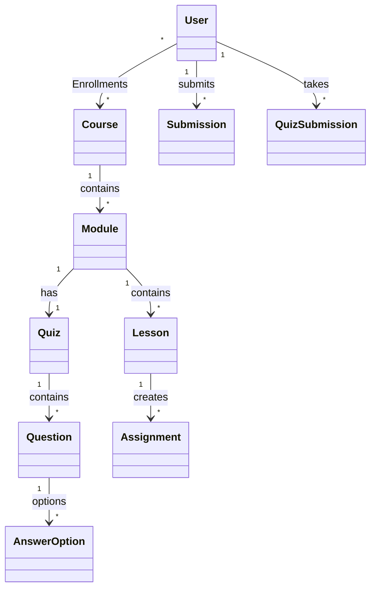

# 🎓 Learning Platform 


**Learning Platform** — это Cloud-Native Backend для образовательной онлайн-платформы. Система обеспечивает полный цикл обучения: от создания курсов и записи студентов до сдачи домашних заданий и прохождения тестирования.

Проект полностью контейнеризирован и готов к развертыванию одной командой благодаря **Docker Compose**.

---

## 🚀 Ключевые возможности

### 📚 Управление контентом
* **Иерархия курсов:** Курс → Модули → Уроки.
* **Глубокая вложенность:** Связи `OneToMany` и `ManyToOne` настроены каскадно.
* **Lazy Loading:** Оптимизированная загрузка данных (решение проблемы N+1 и `LazyInitializationException`).

### 🎓 Процесс обучения
* **Регистрация:** Студенты могут записываться на курсы (проверка уникальности, связь `ManyToMany`).
* **Домашние задания:** Преподаватель создает задания (`Assignment`), студенты отправляют решения (`Submission`).
* **Система тестирования:** Полноценный движок Quiz:
    * Тест привязан к модулю.
    * Содержит вопросы (`Question`) и варианты ответов (`AnswerOption`).
    * Автоматический подсчет и сохранение результатов.

### 🛠 Техническое совершенство
* **DevOps:** Multi-stage Docker build (сборка Maven внутри контейнера).
* **REST API:** Полное покрытие всех сущностей контроллерами.
* **DTO Pattern:** Использование Data Transfer Objects для безопасности и чистоты API.
* **Error Handling:** Централизованная обработка ошибок через `@ControllerAdvice`.
* **Data Seeding:** Автоматическое наполнение базы демо-данными при старте.

---

## 🛠️ Технологический стек

| Технология | Назначение |
| :--- | :--- |
| **Java 17** | Основной язык разработки |
| **Spring Boot 3** | Фреймворк приложения |
| **Spring Data JPA** | Работа с базой данных (Hibernate) |
| **PostgreSQL** | Реляционная база данных |
| **Docker** | Контейнеризация приложения и БД |
| **Docker Compose** | Оркестрация сервисов |
| **Lombok** | Сокращение бойлерплейт-кода |

---

## 🐳 Как запустить проект (Docker Way)

Вам **не нужно** устанавливать Java или Maven локально. Достаточно иметь Docker.

### Шаг 1: Запуск
Выполните одну команду в корне проекта:

```bash
docker-compose up --build
```

## Docker автоматически:

* Скачает образ Maven и соберет .jar файл приложения.

* Создаст легкий образ с JRE 17 (Alpine Linux).

* Запустит базу данных PostgreSQL.

* Запустит Backend и свяжет его с базой.

### Шаг 2: Проверка

Приложение будет доступно по адресу: http://localhost:8080

Чтобы остановить проект:

```bash
docker-compose down
```


💻 Локальная разработка (Dev Way)
---------------------------------

Если вы хотите разрабатывать код в IDE (IntelliJ IDEA, Eclipse, VS Code):

1.  Bashdocker-compose up db -d

2.  Bash./mvnw spring-boot:run*(Приложение автоматически подключится к БД на порту 5432)*.

📡 API Документация
-------------------

В приложении реализован REST API. Вот основные эндпоинты для тестирования.

### 1\. Курсы (/api/courses)

**МетодURLОписание**

| Метод | URL               | Описание         
|------:|-------------------|-------------------|
| GET  | /api/courses  | Получить список всех курсов |
| GET  | /api/courses/{id}| Получить детальную информацию о курсе | 
|POST | /api/courses | Создать новый курс |
|DELETE | /api/courses/{id} | Удалить курс по ID |
		


**Пример создания курса (cURL):**

```json

curl -X POST http://localhost:8080/api/courses

-H "Content-Type: application/json"

-d '{"title": "Docker Mastery", "description": "From Zero to Hero"}'

```

### 2\. Запись на курс (/api/enrollments)

**МетодURLОписание**

| Метод | URL               | Описание         
|------:|-------------------|-------------------|
|POST | /api/enrollments | Записать студента на курс |

**Пример запроса:**

```JSON
{

 "studentId": 2,

 "courseId": 1

}

```

### 3\. Домашние задания (/api/assignments, /api/submissions)

**МетодURLОписание**

| Метод | URL               | Описание         
|------:|-------------------|-------------------|
| GET  | /api/assignments/course/{id}  | Посмотреть задания по ID курса |
| POST  | /api/submissions| Отправить решение на проверку | 

### 4\. Тесты (/api/quizzes)

**МетодURLОписание**

| Метод | URL               | Описание         
|------:|-------------------|-------------------|
| GET  | /api/quizzes/course/{id}  | Получить тест и вопросы для курса |

🧪 Тестирование
---------------

Проект покрыт интеграционными тестами для проверки REST-контроллеров и контекста Spring. 
Тесты запускаются в изолированной среде с использованием базы данных H2, что исключает конфликты с реальной БД.
Для запуска тестов (локально):

```bash

 mvn test

```
> **⚠️Важно:**  Приложение настроено на автоматическое заполнение базы данными при старте (DataInitializer). Если при запуске тестов вы получаете ошибку DataIntegrityViolationException (дублирование данных), у вас есть два варианта:
Закомментируйте строку initData(); в методе run класса DataInitializer.java.
Или очистите базу данных перед тестами: docker-compose down -v.

🏗️ Архитектура базы данных
---------------------------

Модель данных спроектирована по 3-й нормальной форме и включает более 15 сущностей.



📂 Структура проекта
--------------------

```Plaintext

src/main/java/com/example/learningplatform

├── controller      # REST контроллеры (API Layer)

├── dto             # Объекты передачи данных (Data Transfer Objects)

├── entity          # JPA сущности (Database Layer)

├── repository      # Интерфейсы доступа к БД (DAO)

├── service         # Бизнес-логика (Business Layer)

├── Dockerfile      # Конфигурация сборки образа

├── docker-compose.yml # Оркестрация (App + DB)

└── LearningPlatformApplication.java

```